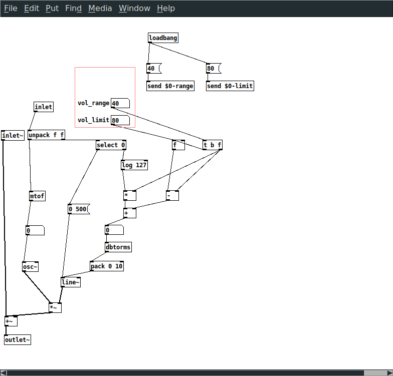

# Synth0

Polyphonic four-voice synth made in [Pure Data](https://puredata.info/).

# License
This project is available under the Hippocratic License. It is similar to the MIT License, but terminates if used to violate human rights. See [firstdonoharm.dev](https://firstdonoharm.dev/) for more info.
